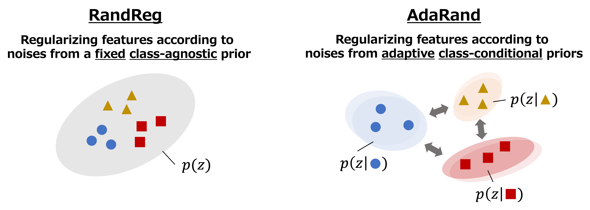

# A PyTorch Implementation of Adaptive Random Feature Regularization (CVPR'24)
[[arXiv]](https://arxiv.org/abs/2403.10097)



## Requirements
### Software Requirements
* CUDA >= 11.7
### Python Requirements
* Please see `pyproject.toml`

## Preparations
Here, we describe the preparation for the experiments on StanfordCars.
You can use other datasets by modifying the preparation scripts.
### Target Datset: StanfordCars
  1. Download the dataset from [here](https://ai.stanford.edu/~jkrause/cars/car_dataset.html) including `{train,test}_annos.npz`
  2. Install the dataset into `./data/StanfordCars`
  3. Run the preparation script as follows:
  ```sh
  cd ./data/StanfordCars/
  python3 ../script/split_train_test.py
  ```

## Example
### Run Training of AdaRand with ResNet-50

```sh
python3 main/train.py --config_path config/04_adarand/rn50.yaml
```

## Citation
```
@inproceedings{Yamaguchi_CVPR24_AdaRand,
  title={Regularizing CNN transfer learning with randomised regression},
  author={Yamaguchi, Shin'ya and Kanai, Sekitoshi and Adachi, Kazuki and Chijiwa, Daiki},
  booktitle={Proceedings of the IEEE/CVF Conference on Computer Vision and Pattern Recognition},
  year={2024}
}
```